<h1 align="center">Hi, I'm Burak 👋</h1>

  A passionate <b>AI & Full Stack Developer</b> from Türkiye 🇹🇷  
  🚀 Founder of <b>NuggetLabs</b> — building automation & smart software systems  
  💡 Project-Based Developer @ <b>Karanix</b> (Antalya)  
  🎓 OSTİM Technical University graduate, focused on hands-on learning and real-world projects  
  🧠 Passionate about Artificial Intelligence, Automation, and Entrepreneurship

---

<h2 align="center">💡 About Me</h2>

- 💻 Developing end-to-end full stack and AI-powered web applications  
- 🎯 Completed internships across 6 tech companies — gained experience in healthcare, AI, and SaaS projects  
- 🧬 Winner of TÜBİTAK National Research Competition (AI & Biotechnology)  
- 🚀 Founded my second startup during my job search process to build automation-based software systems  
- 📚 Continuously learning new technologies and improving English (currently B1 level)  
- 🤝 Open to collaborations in AI, automation, and full-stack development  

  <b>“I believe taking big risks at a young age leads to extraordinary growth.”</b>

---

<h2 align="center">💼 Internships & Achievements</h2>

  

    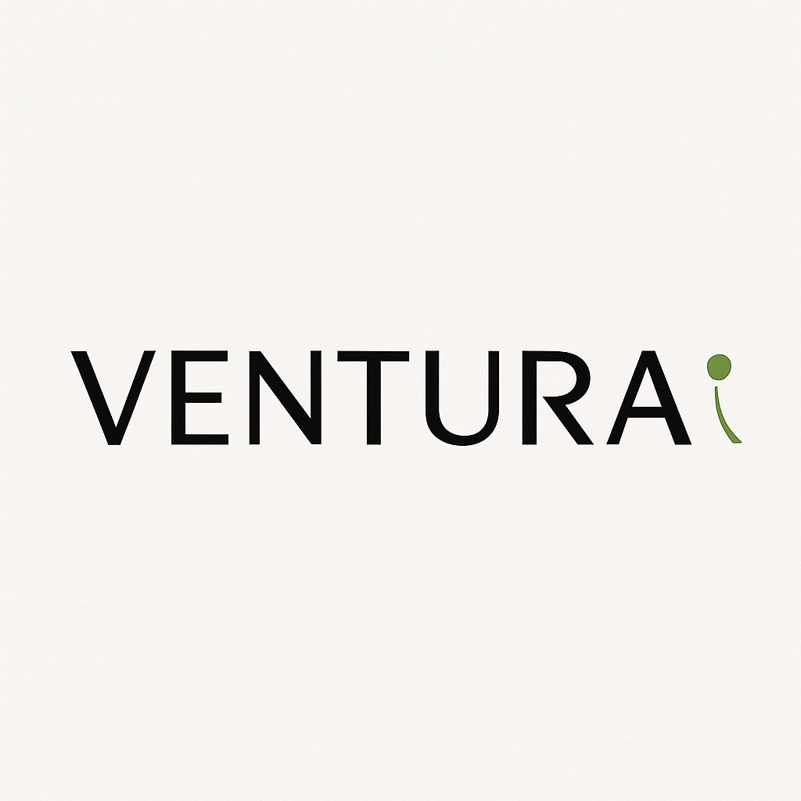
    
<b>Ventura Yazılım</b> Full Stack Developer Intern

  

  

    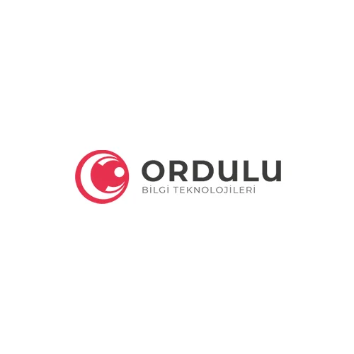
    
<b>Ordulu Teknoloji</b> AI & Deep Learning Intern

  

  

    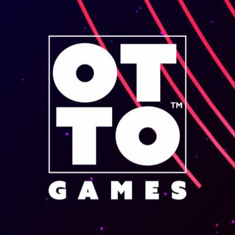
    
<b>OTTO Games</b> Game Developer Intern

  

  

    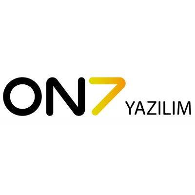
    
<b>ON7 Software</b> Front-End Developer Intern

  

  

    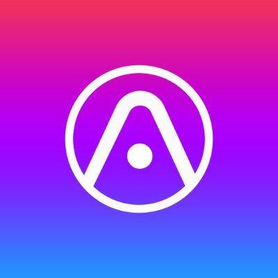
    
<b>Atlaspad</b> Marketing Intern – Florida

  

  

    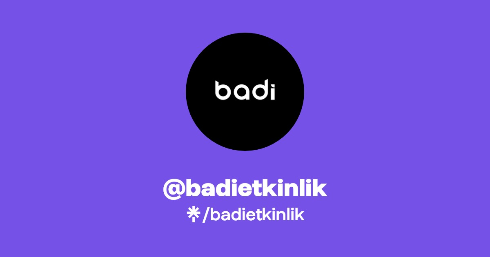
    
<b>Badi Etkinlik</b> Marketing Intern

  

---

<h2 align="center">🥇 TÜBİTAK Achievement</h2>

  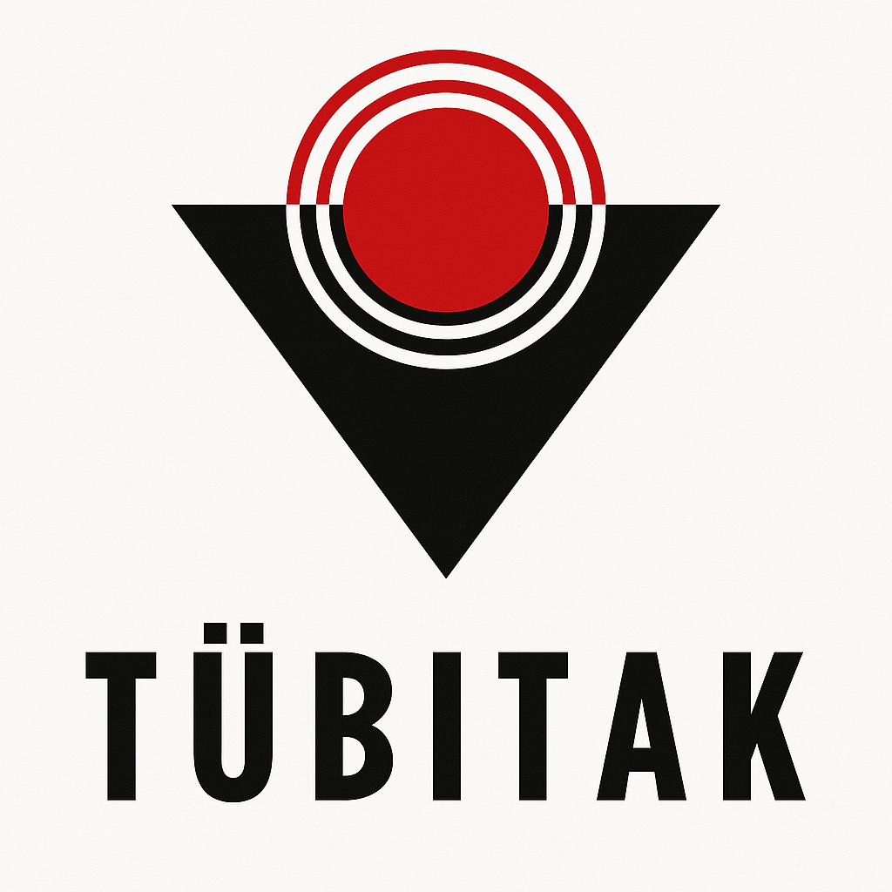

  <i>
  Developed a deep learning model that classified stem cell differentiation with 100% accuracy across 68 images.  
  Combined artificial intelligence and biotechnology to explore neuron formation — awarded 1st place at the TÜBİTAK National Research Competition.
  </i>

---

<h2 align="center">🧠 Bootcamps & Trainings</h2>

  

    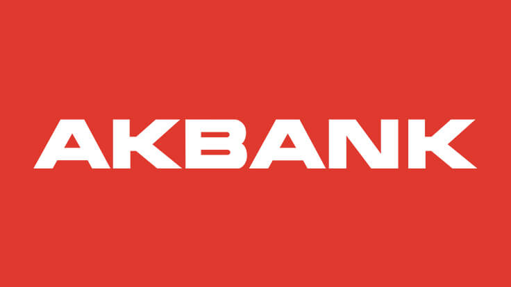
    
<b>Akbank Machine Learning Bootcamp</b> AI Bootcamp Student – 1 Month

  

  

    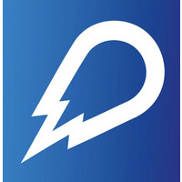
    
<b>Global AI Hub Bootcamp</b> AI Bootcamp Student – 1 Month

  

  

    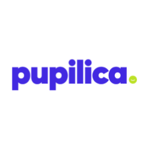
    
<b>Pupilica AI Bootcamp</b> AI Bootcamp Student – 1 Month

  

  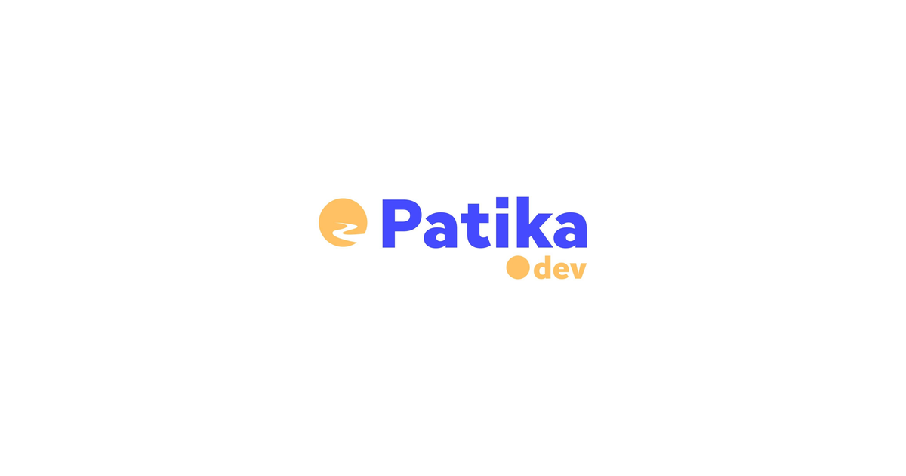

  <i>
  This intensive 8-month program provided comprehensive, hands-on training in full-stack web development.  
  I gained in-depth knowledge of modern frontend and backend technologies — focusing on React, C#, and .NET.  
  Through real-world projects, I developed the ability to build scalable and high-performance applications.
  </i>

---

<h2 align="center">📈 GitHub Stats & Activity</h2>

  
  
  

  

